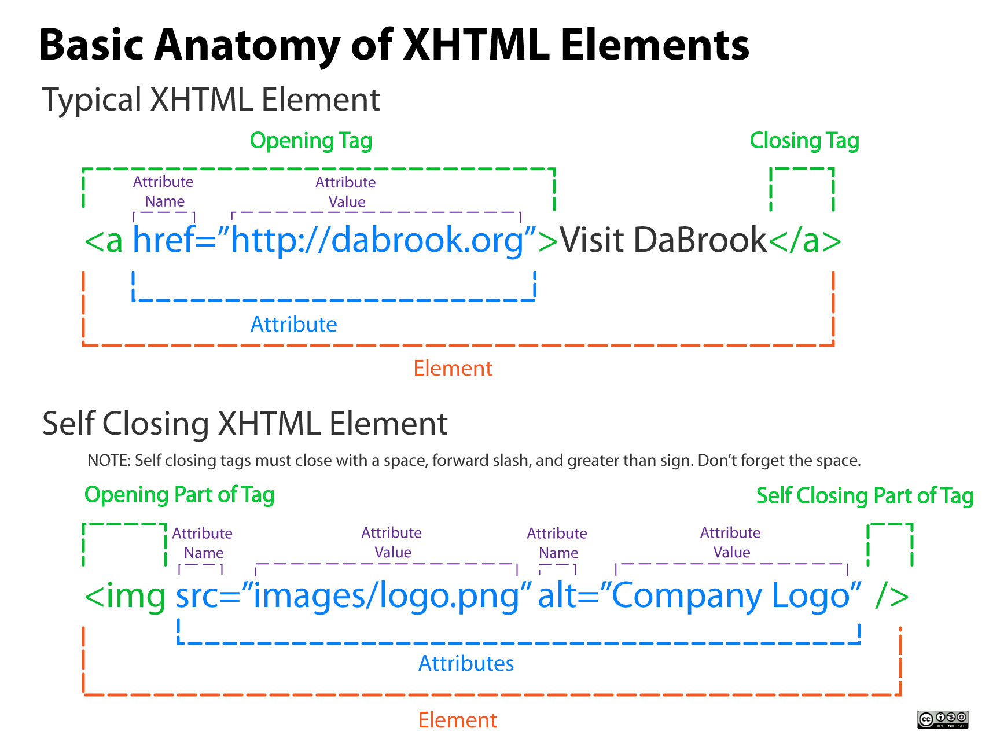
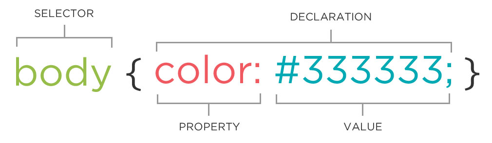
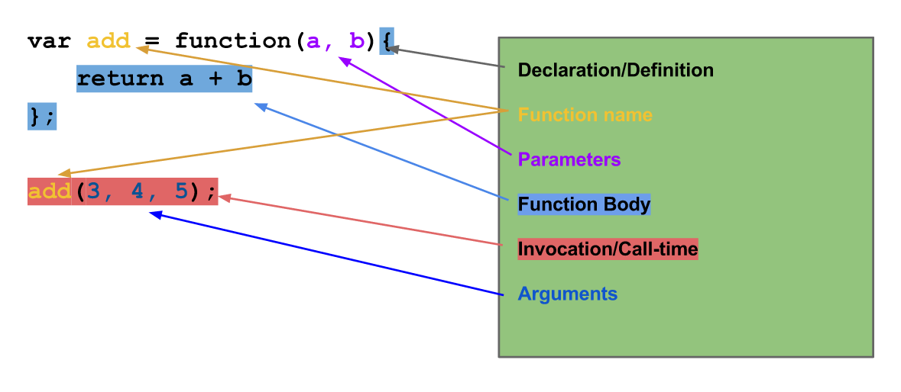

# How to Learn
Learning Techniques for Developers

## I don't even know where to start.

1. Start by [looking back at your lessons](https://github.com/den-wdi-3/schedule/tree/master) - the material in your assignments is covered in past assignments.
2. Ask a classmate - they're likely to get stuck on the same issues.
3. If you don't know how to phrase what you're looking for, Google the closest thing you can think of (i.e. "Add div to page in JS"). You will likely start to discover key words that can then be Googled again (i.e. "Append, DOM, etc"). 

## I can't remember how to __________

1. Use Google to find lists of common syntax and practices. For instance:
    - [Basic Terminal Commands](https://github.com/0nn0/terminal-mac-cheatsheet)
    - [Basic Git Commands](https://confluence.atlassian.com/bitbucketserver/basic-git-commands-776639767.html)
    - [HTML Elements](https://www.w3schools.com/tags/)
    - [CSS Properties](https://www.w3schools.com/cssref/)
    - [JS Methods](https://developer.mozilla.org/en-US/docs/Web/JavaScript/Reference/Methods_Index)
    - [Anatomy of a JS Function](https://danmartensen.svbtle.com/the-anatomy-of-a-javascript-function)
    - [JS Callbacks Explained with Minions (sorry)](https://medium.freecodecamp.com/javascript-callbacks-explained-using-minions-da272f4d9bcd)
    - [Anatomy of Code](http://www.anatomyofcode.com/)
2. [Look back at your classes.](https://github.com/den-wdi-3/schedule/tree/master) Most of the answers have been covered in previous lessons.

### Anatomy of HTML

### Anatomy of CSS

### Anatomy of a JS Function

## This is taking too long.

Unfortunately, a certain ammount of time is needed to get good at development - you will have to fail many times to start succeeding. Try to not look at the time you spend fixing bugs as a "waste" - it is a neccessary step in learning.

## I'm still stuck.

1. **Take a break.** Walking away from your work to eat, exercise, or relax will allow your brain to 'reset'.
2. **Prioritize your health over progress.** Lack of sleep, poor health, and lingering anxiety will cause you to learn slower and remember less. Even if you're feeling behind, taking care of yourself first, and you'll be able to catch up faster.

